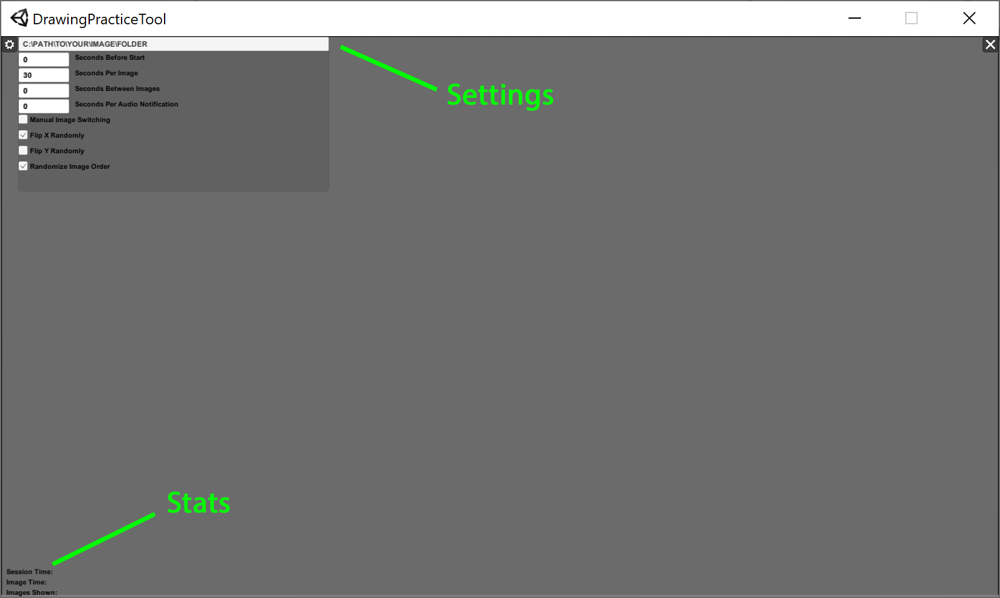
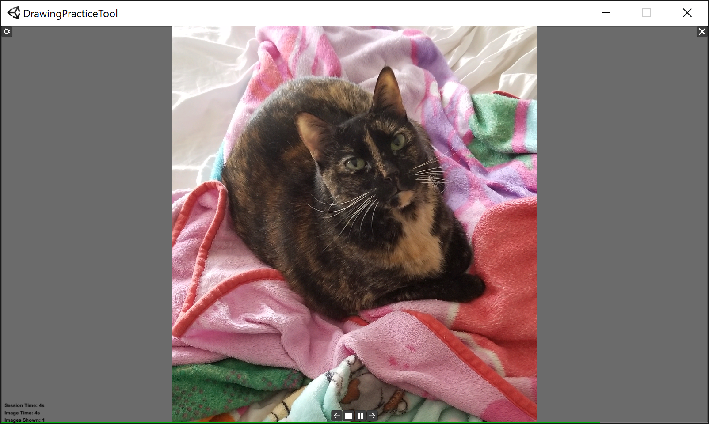

# DrawingPracticeApp
Supported OS: Windows 10

Unity Version: 2019.1.4f1

## The problem:
There are websites targeted at helping you improve at quick gesture drawing by allowing you to select some types of images and how long to give you to draw them as they cycle through. This can be a great starting point but you are limited to their selection of images. Maybe you want to do gesture drawings of Fennec Foxes, such practice sites won't have them.

## The solution:
As an MFA student I wnated an app that lets me load images from a folder on my system to focus quick studies on whatever I wanted and now this power can be yours too! If the app is helpful to you, consider following my arty journey on your social networks of choice:
* [Instagram](https://www.instagram.com/ProMorearty)
* [Pinterest](https://www.pinterest.com/ProMorearty/my-arty-journey/)
* [Twitter](https://www.twitter.com/ProMorearty)
* [Facebook](https://www.facebook.com/ProMorearty)

If you want to support my arty journey, I'm always in need of art supplies and caffiene :heart_eyes: 

## Instructions
1) Download the current release, unzip it, and launch DrawingPracticeTool.exe or clone the repo and build it with Unity. I generally keep it in 1600x900 windowed mode.
2) Click the gear icon to open settings and set your folder and anything else you want, they will be saved for next time :smiley:
3) Press the Play icon.

# Features:
- Automatic and Manual image cycling
- Randomized image selection so you don't know what is next :smiley:
- Horizontal and Vertical Image flipping (flipping effectively increases your image library size)
- Simple stats

### TODO
* Add image effects such as greyscale and blur
* Tooltips
* Text error messages
* Better scaling?
* List recent folders?
* Cross platform compatibility?
